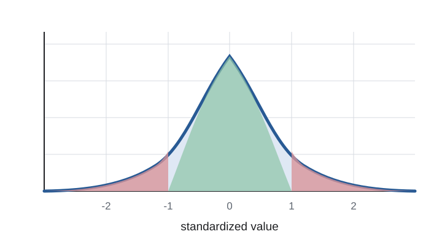

# 默认章节页

一级标题默认生成**通栏色带**，紧贴页眉下方 —— 这是 Beamer 上游的做法（`\section` 页复用 frametitle 模板）。它的文字左边缘与后面的 frame title、正文严格对齐。

## 内容组织 {data-subsection="排版"}

### 清晰、紧凑、适合教学与学术报告

这套主题保留 Beamer 的 frame title 和页脚信息栏；标题、作者、日期与页码自动进入信息栏，无需手工维护。

- 一级条目使用扁平实心方块
  - 二级条目使用短横线
    - 三级条目使用空心方块
- 支持 **粗体**、*强调*、[链接](https://quarto.org) 与 [警示信息]{.alert}

1. 编号以紧凑色块呈现
2. 层级清楚，不使用立体小球
3. 长文本会自然换行并保持对齐

# 三种章节页外观 {.section-badge}

这一页用了 `{.section-badge}`：**居中圆角块 + 阴影**，左右内缩 12%，字号更大。

它放弃了左对齐，换来与普通 frame 更强的区分度，适合每章的起首页。

## 外观用法 {data-subsection="章节页"}

三种外观用属性**逐页**选择，默认不需要任何属性：

| 写法 | 外观 |
|:---|:---|
| `# 标题` | 通栏色带，紧贴页眉（默认） |
| `# 标题 {.section-badge}` | 居中圆角块，带阴影 |
| `# 标题 {.section-minimal}` | 只有文字，无底色 |

: 章节页的三种外观

属性只决定章节页**长什么样**，不能决定它**是否存在** —— Reveal.js 按 `slide-level` 在渲染前就已把 `#` 切成独立页面。

# 最简章节页 {.section-minimal}

`.section-minimal` 只有文字、没有底色，用于弱化章节页。底色与背景冲突时它也更干净。

## Beamer 组件 {data-subsection="组件"}

三种 block 承载不同的语义权重：

::: {.block title="定义"}
普通 block：用于定义、命题等中性内容。Madrid 下是深蓝标题条，正文是标题色的淡染。
:::

::: {.exampleblock title="示例"}
Example block：用于示例与成功情形。Madrid 下标题条是深绿 `#006000`。
:::

::: {.alertblock title="注意"}
Alert block：用于警告与需要强调的内容。Madrid 下标题条是深红 `#bf0000`。
:::

# 内容呈现

## 行内样式 {data-subsection="强调"}

除 `.alert` 外，还有 `.fg` 与 `.bg` 两个行内辅助类，颜色用 `--col` 指定：

- [警示文字]{.alert}：使用主题的警示色
- [自定义前景色]{.fg style="--col: #2c7550"}：只改文字颜色
- [自定义背景色]{.bg style="--col: #f5dfe1"}：给文字加底色
- [[查看总结]{.button}](#sec-summary)：Beamer 风格的跳转按钮

## 双栏布局 {data-subsection="布局"}

:::: {.columns}

::: {.column width="48%"}
### 左栏

- 观点先行
- 一页一个主要结论
- 通过 block 强化结构
:::

::: {.column width="48%"}
### 右栏

> 好的幻灯片不是缩小的论文，而是清晰的叙事界面。

右栏适合放对照内容、结论或一张图。
:::

::::

## 表格与代码 {data-subsection="数据"}

:::: {.columns}

::: {.column width="52%"}
| 主题 | 主色 | 气质 |
|:---|:---|:---|
| Madrid | 深蓝 | 稳健、理性 |
| CambridgeUS | 酒红 | 经典、正式 |
| 共通设计 | 白与炭黑 | 清爽、易读 |

: 主题配色对照
:::

::: {.column width="44%"}
```{.r filename="render-slides.R"}
library(quarto)

quarto_render(
  input = "slides.qmd"
)
```
:::

::::

## 图片与引用 {data-subsection="图文"}

:::: {.columns}

::: {.column width="56%"}
{#fig-normal width="94%"}
:::

::: {.column width="40%"}
### 图文关系

图像使用 Quarto 原生 figure 结构，图注与正文保持同一视觉层级。主题结构参考 Reveal.js 的内容组织方式 [@quarto]，简洁组件借鉴 Clean 主题 [@clean-theme]。

> 引用块保留克制的底色与左侧强调线，适合放置定义、原话或来源说明。
:::

::::

## 数学与强调 {data-subsection="公式"}

::: {.block title="中心极限定理"}
若 $X_1, X_2, \ldots$ 独立同分布，且方差有限，则

$$
\sqrt{n}\left(\bar X_n-\mu\right)
\xrightarrow{d} \mathcal{N}(0,\sigma^2).
$$
:::

公式默认使用扩展内置的固定版本 KaTeX，断网打开也能完整渲染；行内公式放大 2%，行间公式放大 6%。注意 KaTeX 是按相对路径 `_extensions/beamerslides/katex/` 动态加载的，`embed-resources: true` **不会**把它内联——单独把 HTML 文件搬走会让公式静默失效，请让 `_extensions/beamerslides/` 与它同行。

# 总结

## 两套经典外观，一个现代格式 {#sec-summary data-subsection="总结"}

- `beamer-variant: madrid`：沉稳的蓝色学术风格，默认无页眉
- `beamer-variant: cambridgeus`：经典的酒红色报告风格，默认显示章节导航页眉
- frame、作者、标题、日期和页码自动进入信息栏；页眉可用 `beamer-secheader` 覆盖
- 完整兼容 Quarto Reveal.js 的 fragments、代码、公式与布局能力

::: {.exampleblock title="开始使用"}
复制模板，替换标题和内容，然后运行 `quarto preview`。
:::

## 参考文献 {data-subsection="来源"}

::: {#refs}
:::
